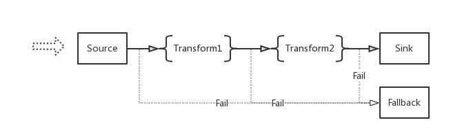

# Start From A Real Scenario:

Let's say we are a technique company, and we have some isolate systems:

1. Business System (mainly serves the end clients with business logics)
2. Search System (providers search service to other systems)
3. Data Mining System (mining data, generating report and providers cleared data for other services)
4. Notification System (notifies users for something happened)

**The workflow will be like this:**

<a href="../event-bus/assets/systems_workflow.png" target="_blank"></a>

**Then let's list some requirements:**

- the "Business System" needs a Queue to handler some heavy processes.
  Dispatch the reuqest to a Queue, And handler the request on a backend process asynchronously
- If something happened on the "Business System", Then tell other systems  
  For example: A user updated his profile   
  Then tell the "Search System" to updated related data as well  
  And tell the "Data Mining System" for this new event  
  Then tell the "Notification System" to notify the user for the changes by mail or other ways. 
- the "Search System" subscribes all search realtead "Events", And do actions according to the "Event"
- the "Data Mining System" listening on all "Events" happenes on among all systems, And record the "Events" to data warehouse with some kind of unstandable format.
- the "Notification System" listening on "Notify Events" and also emit "Events" like a user's email got bounced. 
- Easily tracking the lifetime of a "Event"
- ...

These requirements cover most of important ports of EventBus, A system distributes "Event"/"Message" among multiple systems with unified format.
Let's go to satisfy these requirements by EventBus.


# Installation

## Requirements

- Java 1.8+ installed
- Sbt
- Zookeeper
- Kafka 0.10+ (only when use Kafka Source/Kafka Sink)
- Cassandra (only when use Cassandra Fallback)

## Install Zookeepr

[Zookeeper Getting Started](https://zookeeper.apache.org/doc/current/zookeeperStarted.html#ch_GettingStarted)

## Install Kafka

[Kafka Quick Start](https://kafka.apache.org/0110/documentation.html#quickstart)

## Install EventBus

### From Source

```bash
> git clone https://github.com/thenetcircle/event-bus.git
```

# Launch EventBus

## Setup

After we installed and started all dependencies, We can setup EventBus by it's configuration.(Please check the [configuration section](./overview/#configuration))

For example let's change the zookeeper address of application.conf to be:

```json
zookeeper {
  servers = "localhost:2181"
  rootpath = "/testnode"
}
```

## Compile & Run

EventBus includes two main components, Runner and Admin. Which are the two sub-projects in the source code as well (Runner is inside core).

- Let's stage the project first
```sh
> cd ${the_root_path_of_event_bus}
> sbt stage
```

- Launch Runner
```sh
> # uses environment variables for some settings, you can also set them inside application.conf directly
> EB_APPNAME=${application_name} EB_DEV=dev EB_RUNNERNAME=default-runner ./target/universal/stage/bin/runner
```

- Launch Admin
```sh
> # changes admin listen port to be 8080, default is 8990
> EB_APPNAME=${application_name} EB_DEV=dev ./target/universal/stage/bin/admin -Dapp.admin.port=8080
```

Now open the url [http://localhost:8080](http://localhost:8080) you will see the homepage of admin interface.

# Workflow

## Workflow of EventBus

EventBus internal includes a list of stories, The word "story" is a virtual concept. Which describes a scenario about transfer data from one point to another point.  
For more details please check [Overview Section](overview)  

A story includes **a Source**, **a Sink**, maybe **a couple of Transforms** and **a Fallback**  
The internal structure of a story looks like this:
<a href="../event-bus/assets/event-bus-workflow.png" target="_blank"></a>

Data/Event come from the left side and eventually will reach right side, That's a end of the story.
We could have some different stories running paralleln   
For example: one story listening on a HTTP port and deliveries data to Kafka, And another one listening on Kafka Topics deliveries data to a HTTP EndPoint.

<a href="../event-bus/event-bus/assets/two_stories.png" target="_blank"></a>

There suppose to be some different **Souce**/**Sink**/**Transforms**/**Fallback** implementations (For now only implemented Http Souce/Sink, Kafka Souce/Sink, Cassandra Fallback), In the future could be **Redis Souce**, **JMS Sink**, etc...

## Workflow of Our Current Scenario:

Back to our current scenario, What the workflow looks like?   
How the different systems working together with EventBus?

<a href="../event-bus/assets/systems_and_eventbus.png" target="_blank"></a>

1. Business send Events to EventBus by HTTP Request
2. EventBus stores the requset to Kafka
3. There are sereral EventBus stories which subscribing on Kafka topcis and send data to specific systems by HTTP requests. 

# Create Stories

Let's open [the Admin Interface (http://localhost:8080)](http://localhost:8080)  
Click "New Story" button on the navagator.

<a href="../event-bus/assets/admin_create_story.png" target="_blank"></a>

Like we mentioned before, We need a couple of stories to satisfy the workflow.  
We need a first story which listening on a HTTP port and transferring data to Kafka, It should be like this:  

<a href="../event-bus/assets/admin_story_http_to_kafka.png" target="_blank"></a>

After the story is created, We also should assign it to a **Runner**(run stories). For more details, please check [Overview Section](overview).

Okay, Now the first story is created and running, We also need to create a couple of other stories to subscribe on specific Kafka topics and send data to specific systems by HTTP.  
It should be like this(don't forget to assign it to a **Runner**):

<a href="../event-bus/assets/admin_story_kafka_to_data_mining.png" target="_blank"></a>

Now the configuration of EventBus is done, A HTTP request sent to the HTTP port listened by the story, will be directly send to Kafka.   
And other stories will fetch the request from Kafka, to send it to different systems.

# Fallback 

# Tracking

# Monitoring

## Grafana 

We use [Grafana](https://grafana.com) to present some metrics for monitoring the health of EventBus

<a href="../event-bus/assets/grafana01.png" target="_blank"></a>

## Sentry

And use [Sentry](https://sentry.io) for Error Tracking

<a href="../event-bus/assets/sentry01.png" target="_blank"></a>