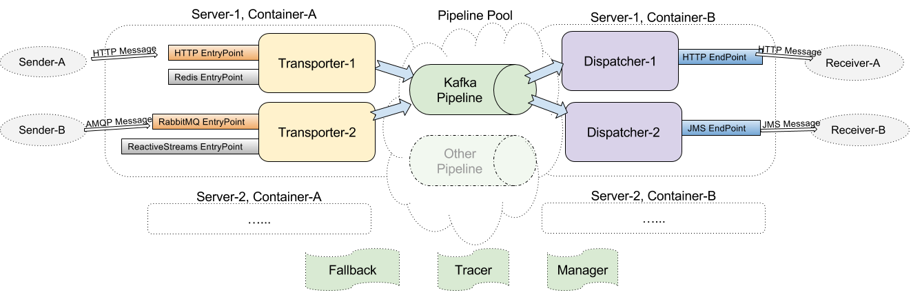

EventBus likes a postman delivering events/messages from multiple sources to multiple targets, Also supports features like data persistence(by Pipeline, default using Kafka), fallback solution(for example if delivery failed) etc...

## Features

- Supplies multiple sources and sinks (HTTP for now).
- Supplies multiple pipelines (Kafka for now)
- Retry and Fallback
- Supplies tracing and monitoring

## Contributing
Pull requests are welcome. For major changes, please open an issue first
to discuss what you would like to change.

Please make sure to update tests as appropriate.