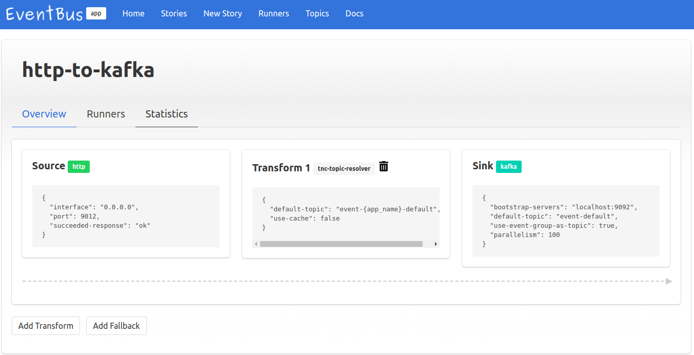

# Admin Interface

After you launch Admin Module, You can visit the Admin Interface by the port you specified (by default it's http://localhost:8990)  
Here is a demo page of the Admin Interface: [Demo](https://thenetcircle.github.io/event-bus/admin/))

Following are some of the functions the Admin Interface providered:

- Create New Story

<a href="../event-bus/assets/admin_create_story.png" target="_blank"></a>

- Manage Story

<a href="../event-bus/assets/admin_manage_story.png" target="_blank"></a>

# Deployment

## Ansible

Just a example of the Ansible script we are using for runner deployment (admin deployment is spearated, but similar):

- **site.yml**

```yaml
---
- hosts: lab
  gather_facts: false

  tasks:
    - name: make sure home dir
      file:
        path: "{{ dest_dir }}"
        state: directory
    
    - name: clone or update repository
      git:
        repo=https://github.com/thenetcircle/event-bus.git
        dest={{ dest_dir }}
        version={{ app_version }}
      notify:
        - recompile service
        - restart service
    
    - name: create service unit
      become: true
      template:
        src: "service.j2"
        dest: /lib/systemd/system/{{ service_name }}.service
        mode: 0644
      notify:
        - reload service
        - restart service
    
    - name: start service
      become: true
      systemd:
        name: "{{ service_name }}"
        state: started
    
  handlers:
    - name: recompile service
      command: /usr/bin/env sbt clean compile stage
      args:
        chdir: "{{ dest_dir }}/"
    
    - name: reload service
      become: true
      systemd:
        name: "{{ service_name }}"
        daemon_reload: yes
    
    - name: restart service
      become: true
      systemd:
        name: "{{ service_name }}"
        state: restarted
```

- service.j2

```
[Unit]
Description={{ service_name }} service

[Service]
Type=simple
WorkingDirectory={{ dest_dir }}
Environment="JAVA_HOME={{ java_home }}"
ExecStart={{ dest_dir }}/target/universal/stage/bin/runner "-DEB_APPNAME={{ app_name }}" "-DEB_ENV={{ app_env }}" "-DEB_RUNNERNAME={{ name }}" "-Dapp.zookeeper.servers={{ zookeeper_servers }}" "-Dkamon.statsd.hostname={{ statsd_hostname }}" "-Dapp.monitor.sentry.dsn={{ sentry_dsn }}" "-DEB_LOGREF={{ log_ref }}" "-DEB_LOGLEVEL={{ log_level }}" "-DEB_LOGFILE={{ log_file }}" "-J-Xmx{{ max_heap_size }}"
Restart=always
RestartSec=3
StartLimitIntervalSec=60
StartLimitBurst=5
User={{ daemon_user }}
PermissionsStartOnly=true

[Install]
WantedBy=multi-user.target
```

# Tracking

# Monitoring

## Grafana 

We use [Grafana](https://grafana.com) to present some metrics for monitoring the health of EventBus

<a href="../event-bus/assets/grafana01.png" target="_blank"></a>

## Sentry

And use [Sentry](https://sentry.io) for Error Tracking

<a href="../event-bus/assets/sentry01.png" target="_blank"></a>