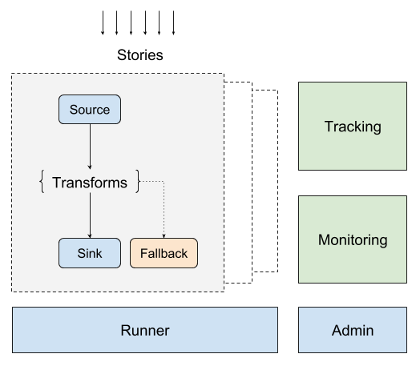

# Concepts & Structure

<a href="../assets/structure_of_eventbus.png" target="_blank"></a>

- **Runner** and **Admin**  

EventBus includes two main components, **Runner** and **Admin**.  
**Runner** intends to be a real logic executor. And **Admin** manages internal state.  
**Runner** located in the "core" folder of root path, **Admin** located in "admin" folder. They are spearated to be two sub projects.  

In real user cases, We may deploy multiple **Runner**s and one **Admin** for a project. **Runner**s are stateless, It can be deployed on one server or multiple different servers for different purposes, It will not do anything since the beginning, just running there waiting for jobs/stories coming.

- **Story**, **Source**, **Sink**, **Transform**, **Fallback**

EventBus is enriched by **Stories**, A **Story** is a basic runnable unit inside EventBus. After a **Story** be created, it should be assigned to a **Runner** or multiple **Runners** based on the situation.

A **Story** includes one **Source**, one **Sink** and maybe a couple of **Transforms** and one **Fallback**.  
The purpose of a **Story** is to transfer data from the **Source** to the **Sink**, In the middle it may go through multiple **Transforms** for data processing. And if it failed on the way, It could be send to the **Fallback** just in case we may process it again.

<a href="assets/event-bus-workflow.png" target="_blank"></a>


# Configuration

## Config Files

|File Path|Description|
|---------|-----------|
|core/src/main/resources/application.conf|Application config file|
|core/src/main/resources/reference.conf|Application default settings, Can be overrided by application.conf|
|core/src/main/resources/akka.conf|Akka config|
|core/src/main/resources/logback.xml|Log config|
|admin/backend/src/main/resources/application.conf|Admin config file|

The configuration files (.conf) is based on [Typesafe Config](https://github.com/typesafehub/config), similar as json.

## Environment Variables

|Variable Name|Description|Default Value|
|-------------|-----------|-------------|
|EB_APPNAME|Application Name||
|EB_ENV|Application Environment, One of following: dev/development, test, prod/production |dev|
|EB_RUNNERNAME|Runner name (Only for runner)||
|EB_LOGLEVEL|Logging Level|DEBUG|
|EB_LOGREF|STDOUT, FILE| STDOUT |

# Internal Tasks

## Sources

### Http Source

Listening on a HTTP port and accpects specific format of data as a Event.

- Default Settings

```json
{
  interface = "0.0.0.0"
  port = 8000
  format = ActivityStreams
  succeeded-response = ok
  # server settings will override the default settings of akka.http.server
  server {
    # max-connections = 1024
    # ...
  }
}
```

### Kafka Source

Subscribe on some Kafka Topics, Fetch the data from Kafka as Events.

- Default Settings

```json
{
  # bootstrap-servers = ""
  # group-id = ""
  # Will use either "topics" or "topic-pattern"
  # topics = []
  # topic-pattern = event-* # supports wildcard if topics are defined will use that one 

  max-concurrent-partitions = 100
  commit-max-batches = 20

  # Properties defined by org.apache.kafka.clients.consumer.ConsumerConfig
  # can be defined in this configuration section.
  properties {
    # Disable auto-commit by default
    "enable.auto.commit" = false
  }
}
```


## Sinks

### Http Sink

Send Events to a HTTP Endpoint

- Default Settings:

```json
{
  # the default request could be overrided by info of the event
  default-request {
    method = POST
    # uri = "http://www.google.com"
  }
  min-backoff = 1 s
  max-backoff = 30 s
  random-factor = 0.2
  max-retrytime = 12 h
  concurrent-retries = 1
  # pool settings will override the default settings of akka.http.host-connection-pool
  pool {
    # max-connections = 4
    # min-connections = 0
    # max-open-requests = 32
    # pipelining-limit = 1
    # idle-timeout = 30 s
    # ...
  }
}
```

### Kafka Sink

Send Events to Kafka

- Default Settings:

```json
{
  # bootstrap-servers = ""
  default-topic = "event-default"
  use-event-group-as-topic = true
  # Tuning parameter of how many sends that can run in parallel.
  parallelism = 100
  # How long to wait for `KafkaProducer.close`
  close-timeout = 60 s
  # Fully qualified config path which holds the dispatcher configuration
  # to be used by the producer stages. Some blocking may occur.
  # When this value is empty the dispatcher configured for the stream
  # will be used.
  use-dispatcher = "akka.kafka.default-dispatcher"
  # Properties defined by org.apache.kafka.clients.producer.ProducerConfig
  # can be defined in this configuration section.
  properties {
  }
}
```

## Transforms

### TNC Topic Resolver

Resolve Kafka Topic based on a predefined topic list and the Event title.

- Default Settings:

```json
{
  contact-points = []
  port = 9042
  parallelism = 3
}
```

## Fallback

### Cassandra Fallback

Store failed events to Cassandra

- Default Settings:

```json
{
  contact-points = []
  port = 9042
  parallelism = 3
}
```
