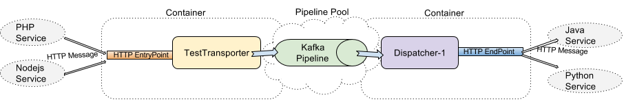

## Background

EventBus works like a postman to delivering stuff from source to target.  
Let's set up a scenario to describe how it works.  

For example if we have a web application which writen by PHP, 
And we have some other backend services using different languages like Java, Nodejs, Python.
And we want that if something happened on any of them, And the thing have to be aware by other services for perhaps some updates.     

The flow will be work like this:

<a href="assets/quickstart.png" target="_blank"></a>

## Setting up EventBus

First of all we need to tell EventBus what to do, Since EventBus supports multiple different sources(called EntryPoint in EventBus) and targets(called EndPoint). We need to point out which of them is using in this scenario.  
Let's create a configuration file to describe this, The configuration file is based on [Typesafe Config](https://github.com/typesafehub/config), similar as json.
Let's create a file called application.conf, Put it on root of EventBus directory.

```json
# includes the original configuration
include "application"

# EventBus runtime configuration
event-bus.runtime {

  # Creates a PipelinePool and declare what Pipelines it has.
  pipeline-pool = [
    {
      name = TestPipeline
      type = kafka
      
      # Sets up the Pipeline specific settings
      akka.kafka.producer {
        kafka-clients {
          bootstrap.servers = "..."
        }
      }
      akka.kafka.consumer {
        kafka-clients {
          bootstrap.servers = "..."
        }
      }
    }
  ]

  # Creates Transporters which will accept data from outside to Pipeline.
  transporters = [{
    name = TestTransporter
    
    # Declares which EntryPoints this Transporter can support.
    entrypoints = [
      {
        type = http
        name = TestEntryPoint1
        
        # EntryPoint specific parameters
        interface = localhost
        port = 8086
      }
    ]
    
    # Declares which Pipeline it using (from PipelinePool)
    pipeline {
      name = TestPipeline
    }
    
    # Transporter specific parameters.
    transport-parallelism = 1
    commit-parallelism = 10
    akka.stream.materializer {}
  }]

  # Creates Dispatchers which will publish data from Pipeline to outside.
  dispatchers = [{
    name = StressTestDispatcher
    
    # Declares which EndPoints this Dispatcher can support.
    endpoints = [{
      type = http
      name = TestEndPoint
      
      # EndPoint specific parameters
      request {
        host = localhost
        port = 8087
        uri = "/"
      }
      akka.http.host-connection-pool {
        max-open-requests = 32
      }
    }]
    
    # Declares which Pipeline it using (from PipelinePool)
    pipeline {
      name = TestPipeline
      
      # The options of using the Pipeline
      outlet {
        group-id = EventBus.TestDispatcher
        topics = ["default"]
      }
    }
  }]
}
```

## Launch EventBus
After you set up the configuration, Please make sure the dependencies are also set up properly. Like: Kafka...  
Then we can launch EventBus by the way if want, Let's using normal way here.

- package EventBus
```sh
sbt clean compile stage
```

- launch with the configuration
```sh
./target/universal/stage/bin/event-bus -Dconfig.file=./application.conf
```

Now EventBus should be listening on localhost port 8086 expecting for HTTP messages, And transporting messages to Kafka then delivering to localhost port 8087 by HTTP.